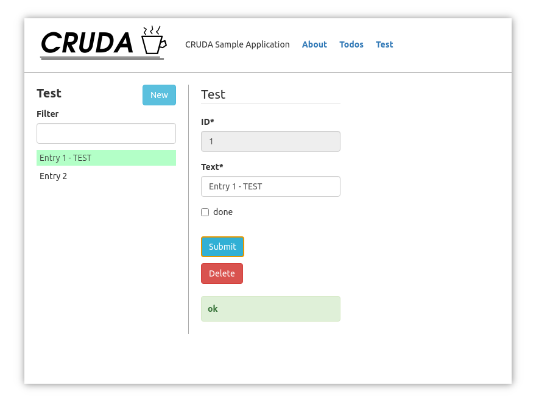

**A CRUD React-Application boilerplate.**

This boilerplate project gives a "ready to code" frontend application that lets
you easily add forms to edit your data entities.

Basically it's an ascetic app to quickly unleash the powers of **react-jsonschema-form**.

## Getting started
The app structure bootstraps from a configuration which is all you need to get started.

Take a look in ```index.jsx``` where the config is load. By default, the configuration from   
**Sample** folder is load to show its capabilities.

## Adopt a data Entity
**3 Steps** to integrate a data Entity into the application.

- Implement the Data Adapter interface
- Define Schemas (JSON Schema and optionally a UI Schema)
- add configuration entry

## Screenshot from Sample Application
To get a visual impression about this app here's a screenshot from the sample application.



---

## Additional Information

**Project name:**

**CRUD A**pplication  
*CRUDA* is spanish and means *raw* which nicely associates with *boilerplate*.

**Open Source stack:**
* <a href="https://github.com/facebook/react">react</a>
* <a href="https://github.com/facebook/create-react-app/tree/master/packages/react-scripts">react-scripts</a>
* <a href="https://github.com/microsoft/TypeScript">TypeScript</a>
* <a href="https://github.com/rjsf-team/react-jsonschema-form">react-jsonschema-form</a>
* any many more: ~ 3.481.939 lines of JS code in ~33.179 files

